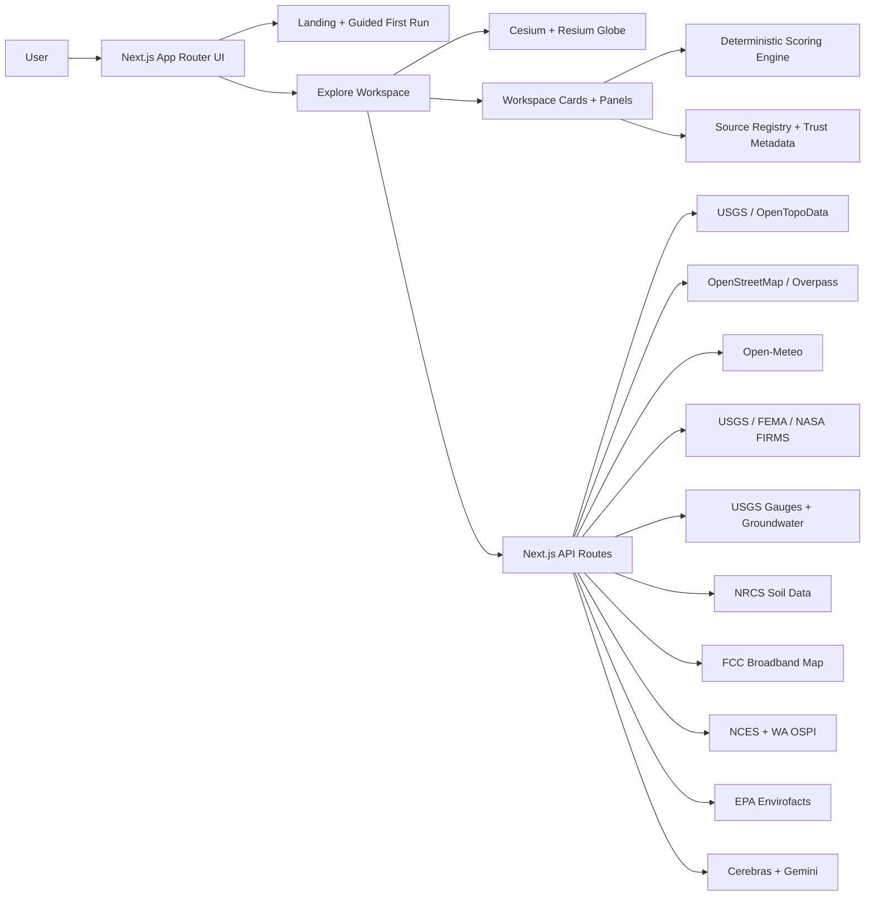

# GeoSight

> **Place intelligence for real-world decisions — no GIS software required.**

**Live App:** [geosight-gspat.vercel.app](https://geosight-gspat.vercel.app/) &nbsp;|&nbsp; **GitHub:** [sabinMas/geosight-gspat](https://github.com/sabinMas/geosight-gspat) &nbsp;|&nbsp; **Built with Codex**

---

## Try It in 60 Seconds

1. Go to [geosight-gspat.vercel.app](https://geosight-gspat.vercel.app/) and click **Watch a Demo**
2. Pick a scenario — **Home Buyer**, **Data Center**, or **Trail Scout**
3. Follow the 5–6 step guided tour
4. After the tour, type a question in the **Ask GeoSight** bar to test the live AI analyst

**Or jump straight into a live demo:**
[→ Yosemite Valley, CA — General Explore](https://geosight-gspat.vercel.app/explore?profile=residential&location=Yosemite+Valley%2C+CA&mode=explorer&lens=general-explore)

Good first-run locations: `Olympic National Park, WA` (Trail Scout) · `Austin, TX` (Land Quick-Check) · `Boulder, CO` (Hunt Planner)

---

## What Is GeoSight?

GeoSight is a **geospatial intelligence platform** that turns any address or coordinate into a multi-signal briefing in under a minute — without needing GIS software or a data analyst.

You pick a **mission lens** (home buying, trail scouting, infrastructure site selection, emergency response, etc.), enter a location, and instantly receive scored, sourced, and explainable intelligence pulled from **40+ live government datasets** — USGS, NOAA, NASA FIRMS, FEMA, EPA, Sentinel-2, and OpenStreetMap.

**GeoSight is not a map viewer or a chatbot.** It scores and ranks geospatial signals by relevance to your specific decision type, labels every source by freshness and coverage, and grounds every AI response in the live data bundle for your current location.

---

## The Problem It Solves

Accessing and interpreting geospatial data currently requires:
- GIS software expertise (ArcGIS, QGIS)
- Knowledge of dozens of government data APIs
- Manual cross-referencing of signals across sources
- Analyst time to produce a structured deliverable

GeoSight compresses that workflow into a single search. A first-time user with no GIS background can go from "I'm considering this location" to a sourced, scored, explainable briefing in under 60 seconds.

---

## Who It's For

| User | Use Case |
|---|---|
| Home buyers | Compare neighborhoods across risk, schools, broadband, amenities |
| Land developers | First-pass site screening for zoning, hazards, terrain, utilities |
| Infrastructure teams | Data center, solar, or agricultural land evaluation |
| Emergency planners | Fire, flood, seismic, and water risk in one view |
| Researchers & analysts | Rapid place investigation with exportable evidence |
| Outdoor users | Trail conditions, terrain, weather, and wildfire proximity |

---

## Key Features

**9 Mission Lenses** — Hunt Planner, Trail Scout, Road Trip, Land Quick-Check, General Explore, Energy & Solar, Agriculture & Land, Emergency Response, Field Research. Each lens re-weights what matters for that decision type. The same place can score well for one lens and poorly for another.

**Deterministic Scoring** — every factor score is calculated from real source data, not generated. Judges can inspect each score component, see what drove it, and trace it to the originating dataset.

**Strict Trust Model** — signals are labeled `live`, `derived`, `limited`, `unavailable`, or `cached`. When a source is unsupported or missing, GeoSight shows the gap instead of guessing. No fabricated data in normal flows.

**GeoAnalyst** — an AI reasoning layer grounded in the live data bundle for the active location. It won't answer questions it doesn't have data for.

**GeoScribe Reports** — structured analyst deliverables exportable as GeoJSON, CSV, or PNG map captures.

**Saved Sites + Comparison Table** — save multiple locations and compare them side by side across all signals.

**Command Palette** (`Cmd+K` / `Ctrl+K`) — navigate any feature instantly.

---

## Data Sources (40+ Live Signals)

| Category | Sources |
|---|---|
| Terrain & Elevation | USGS EPQS, OpenTopoData |
| Weather & Climate | Open-Meteo forecast + 10-year historical archive |
| Active Hazards | USGS earthquakes, NASA FIRMS fire detections, FEMA NFHL flood zones |
| Hydrology | USGS stream gauges, USGS groundwater wells |
| Air & Environment | OpenAQ, Open-Meteo AQ index, EPA Envirofacts contamination screening |
| Soil & Subsurface | USDA NRCS soil profiles, USGS seismic design maps |
| Connectivity | FCC Broadband Map |
| Schools | NCES national data, Washington OSPI accountability data |
| Nearby Places | OpenStreetMap, Overpass API |
| Globe & Visualization | Cesium Ion, Cesium World Terrain |

**Global signals** (work anywhere): climate, terrain, elevation, air quality, active fires, nearby places, seismic context.

**US-first signals** (gaps labeled honestly outside US): broadband, FEMA flood zones, EPA contamination, NRCS soil, USGS groundwater, NCES schools.

---

## How It Was Built

GeoSight was built with **OpenAI Codex** as the main engineer, **Perplexity Pro**,**Claude Code**, and **Kimi K2.6** all working as a multi-agentic team, while I (Mason Sabin) orchestrated the entire project from start to finish, for accelerated development across the full stack — from API route scaffolding and scoring logic to component architecture and the trust metadata system.

**Tech Stack:**

- **Frontend:** Next.js 14 App Router · React 19 · TypeScript · Tailwind CSS v4
- **3D Globe:** Cesium + Resium
- **2D Map:** MapLibre GL
- **AI Reasoning:** Cerebras (llama-3.3-70b) · Google Gemini
- **Caching / Rate Limiting:** Upstash Redis
- **Charts:** Recharts
- **Deployment:** Vercel

**Architecture:**



---

## What GeoSight Does Not Claim

- Not an engineering sign-off or parcel-entitlement system
- Not an appraisal model or replacement for official due diligence
- Proxy heuristics are used where direct live signals don't yet exist — those factors are clearly labeled in the UI

---

## Running Locally

```bash
# 1. Install dependencies
npm install

# 2. Set up environment
cp .env.example .env.local
```

Add your keys to `.env.local`:

| Variable | Required | Purpose |
|---|---|---|
| `NEXT_PUBLIC_CESIUM_ION_TOKEN` | ✅ Required | 3D globe rendering |
| `CEREBRAS_API_KEY` | ✅ Required | AI reasoning (GeoAnalyst) |
| `GEMINI_API_KEY` | ✅ Required | Report generation (GeoScribe) |
| `NASA_FIRMS_MAP_KEY` | Recommended | Improved fire coverage |
| `UPSTASH_REDIS_REST_URL` | Optional | Shared rate limiting |
| `UPSTASH_REDIS_REST_TOKEN` | Optional | Shared rate limiting |

```bash
# 3. Start dev server
npm run dev
# → http://localhost:3000

# Type checks + lint
npm run typecheck
npm run lint
```

## Deployment

GeoSight is Vercel-ready:
1. Push to GitHub
2. Import repo into Vercel
3. Add environment variables
4. Deploy

---

## Repository Structure

| Path | Purpose |
|---|---|
| `src/app/page.tsx` | App entry + landing |
| `src/app/explore/page.tsx` | Explore workspace |
| `src/components/Explore/ExploreWorkspace.tsx` | Main workspace shell |
| `src/hooks/useExploreState.ts` | Core state management |
| `src/hooks/useSiteAnalysis.ts` | Analysis pipeline |
| `src/lib/scoring.ts` | Deterministic scoring engine |
| `src/lib/source-registry.ts` | Source registry + trust metadata |
| `src/app/api/geodata/route.ts` | Main geodata API route |

---

## Backlog & Roadmap

- [`docs/BACKLOG.md`](docs/BACKLOG.md) — planned features and known gaps
- [`agents.md`](agents.md) — platform and product standards