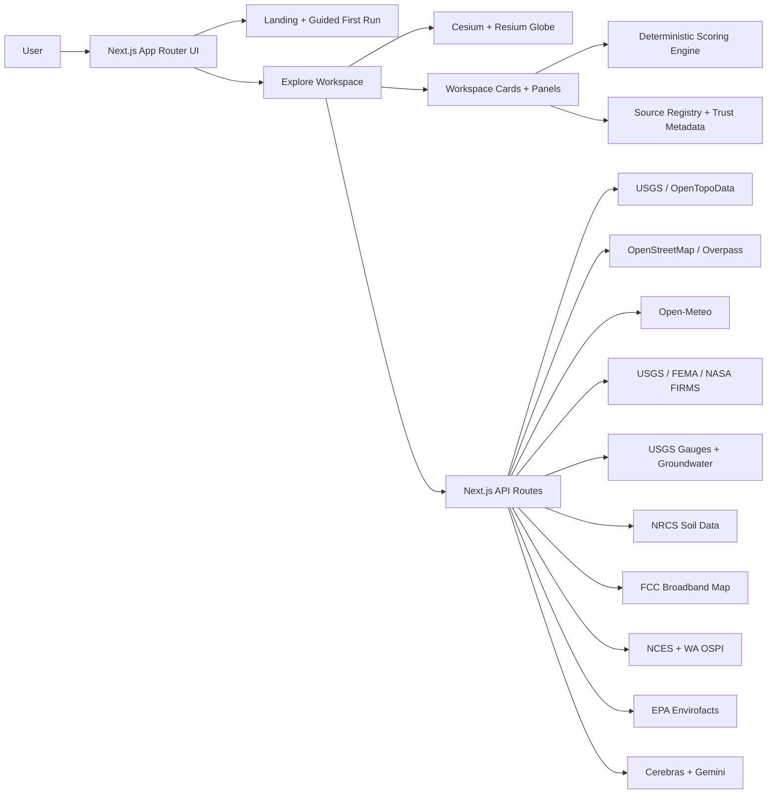

# GeoSight

> **Place intelligence for real-world decisions — no GIS software required.**

**Live App:** [geosight-gspat.vercel.app](https://geosight-gspat.vercel.app/) &nbsp;|&nbsp; **GitHub:** [sabinMas/geosight-gspat](https://github.com/sabinMas/geosight-gspat) &nbsp;|&nbsp; **Built with OpenAI Codex**

---

## Try It in 60 Seconds

1. Go to [geosight-gspat.vercel.app](https://geosight-gspat.vercel.app/) and click **Watch a Demo**
2. Pick a scenario — **Home Buyer**, **Data Center**, or **Trail Scout**
3. Follow the 5–6 step guided tour
4. After the tour, type a question in the **Ask GeoSight** bar to test the live AI analyst

**Or jump straight into a live demo:**
[→ Yosemite Valley, CA — General Explore](https://geosight-gspat.vercel.app/explore?profile=residential&location=Yosemite+Valley%2C+CA&mode=explorer&lens=general-explore)

Good first-run locations: `Olympic National Park, WA` (Trail Scout) · `Austin, TX` (Land Quick-Check) · `Boulder, CO` (Hunt Planner)

---

## The Problem I Wanted to Solve

Here's something I kept running into: geospatial data is everywhere, but actually *using* it is a nightmare. Want to know if a location has wildfire risk, broadband access, flood exposure, and decent schools all at once? Without GIS expertise you're bouncing between a dozen government portals, copy-pasting coordinates, and manually trying to reconcile datasets that were never designed to talk to each other.

I'm a software dev student in Washington, and I kept thinking — this shouldn't be this hard. So I built GeoSight to compress that whole mess into a single search.

GeoSight is a **geospatial intelligence platform** that turns any address or coordinate into a multi-signal briefing in under a minute. You pick a **mission lens** (home buying, trail scouting, infrastructure site selection, emergency response, etc.), enter a location, and instantly get scored, sourced, and explainable intelligence pulled from **40+ live government datasets** — USGS, NOAA, NASA FIRMS, FEMA, EPA, and OpenStreetMap.

**GeoSight is not a map viewer or a chatbot.** It scores and ranks geospatial signals by relevance to your specific decision type, labels every source by freshness and coverage, and grounds every AI response in the live data bundle for your current location.

---

## What I Built and How Codex Made It Real

I orchestrated this entire project as a solo developer and used **OpenAI Codex** as my primary engineering partner throughout. Codex handled a massive amount of the heavy lifting — API route scaffolding, deterministic scoring logic, the trust metadata system, component architecture, and more. I also pulled in **Claude Code**, **Perplexity Pro**, and **Kimi K2.6** as a multi-agent team for specialized tasks, but Codex was the backbone.

What I personally designed, directed, and implemented:
- The **mission lens system** — the idea that the same location means completely different things depending on why you're evaluating it
- The **trust model** — every signal is labeled `live`, `derived`, `limited`, `unavailable`, or `cached`, and GeoSight shows gaps instead of guessing
- The **scoring architecture** — deterministic, traceable scores from real data, not AI-generated numbers
- The full **UX flow** — guided first-run tours, a command palette, a comparison table for saved sites, and exportable reports
- The **multi-agent prompt strategy** that kept Codex producing consistent, high-quality output across 40+ API integrations

This project genuinely wouldn't exist at this scale without Codex. As a student developer, I would have spent months on boilerplate alone. Instead I was able to focus my energy on the hard design decisions — the stuff that actually makes GeoSight useful — and let Codex handle the implementation velocity.

---

## Who It's For

| User | Use Case |
|---|---|
| Home buyers | Compare neighborhoods across risk, schools, broadband, amenities |
| Land developers | First-pass site screening for zoning, hazards, terrain, utilities |
| Infrastructure teams | Data center, solar, or agricultural land evaluation |
| Emergency planners | Fire, flood, seismic, and water risk in one view |
| Researchers & analysts | Rapid place investigation with exportable evidence |
| Outdoor users | Trail conditions, terrain, weather, and wildfire proximity |

---

## Key Features

**9 Mission Lenses** — Hunt Planner, Trail Scout, Road Trip, Land Quick-Check, General Explore, Energy & Solar, Agriculture & Land, Emergency Response, Field Research. Each lens re-weights what matters for that decision type. The same place can score well for one lens and poorly for another.

**Deterministic Scoring** — every factor score is calculated from real source data, not generated. You can inspect each score component, see what drove it, and trace it back to the originating dataset.

**Strict Trust Model** — signals are labeled `live`, `derived`, `limited`, `unavailable`, or `cached`. When a source is unsupported or missing, GeoSight shows the gap instead of guessing. No fabricated data in normal flows.

**GeoAnalyst** — an AI reasoning layer grounded in the live data bundle for the active location. It won't answer questions it doesn't have data for.

**GeoScribe Reports** — structured analyst deliverables exportable as GeoJSON, CSV, or PNG map captures.

**Saved Sites + Comparison Table** — save multiple locations and compare them side by side across all signals.

**Command Palette** (`Cmd+K` / `Ctrl+K`) — navigate any feature instantly.

---

## Data Sources

### Global Baseline (120+ Signals — Available Everywhere)

| Category | Sources |
|---|---|
| Terrain & Elevation | USGS EPQS, OpenTopoData |
| Weather & Climate | Open-Meteo forecast + 10-year historical archive |
| Active Hazards | USGS earthquakes, NASA FIRMS fire detections, GLoFAS flood forecasts |
| Hydrology | OpenStreetMap streams, Copernicus bathymetry |
| Air & Environment | OpenAQ, Open-Meteo AQ index |
| Soil & Subsurface | SoilGrids 2.0, global seismic hazard models |
| Connectivity | FCC Broadband Map (US only; elsewhere global fallback) |
| Population & Land Cover | WorldPop, ESA WorldCover, GADM boundaries |
| Nearby Places | OpenStreetMap, Overpass API |
| Globe & Visualization | Cesium Ion, Cesium World Terrain |

### Regional Data Packs (Phase 3 — 10 Packs, 55-60% Global Population)

| Region | Status | Key Datasets | Population |
|--------|--------|--------------|-----------|
| **Japan** | ✅ Live | GSI tiles, J-SHIS seismic, JMA weather + earthquakes, hazard maps (flood/tsunami/seismic) | 125M |
| **India** | ✅ Live | Bhuvan (hazards, LULC), IMD weather, India-WRIS hydrology, CPCB air quality | 1.4B |
| **Canada** | ✅ Live | NRCan hydrology, CWFIS wildfires, ECCC air quality, NRCAN seismic | 40M |
| **Australia + NZ** | ✅ Live | Geoscience AU hazards + DEM, BoM weather, LINZ topo (NZ), GeoNet seismic (NZ) | 26M |
| **South America** | ✅ Live | INPE deforestation (PRODES/DETER), MapBiomas LULC, USGS seismic, NOAA weather hazards | 430M |
| **MENA** | ✅ Live | USGS seismic, dust/AQ monitoring, Nile + regional water resources, regional weather | 400M+ |
| **China + East Asia** | ✅ Live* | **Taiwan:** data.gov.tw + CWA weather; **Hong Kong:** LandsD + data.gov.hk; **South Korea:** data.go.kr + KMA weather; **Mainland:** global-only baseline (OSM, ERA5, Sentinel-2) | 1.6B |
| **Europe** | ✅ Live | Copernicus (CDS climate, CEMS flood, CLMS LULC), DWD weather, national services | 450M |
| **Sub-Saharan Africa** | ✅ Live | NiMet (Nigeria), KMD (Kenya), South Africa seismic, GEM Africa Mosaic | 1.2B+ |
| **Southeast Asia** | ✅ Live | BMKG (Indonesia seismic + weather), TMD (Thailand), NCHMF (Vietnam), ASMC regional | 650M |

**\* East Asia note:** Taiwan, Hong Kong, and South Korea have excellent dedicated government data. Mainland China coverage is limited to global-baseline datasets due to closed data infrastructure — the UI clearly labels this distinction.

### US-First Signals (Gaps Labeled Honestly Outside US)
- Broadband: FCC Broadband Map (US only; elsewhere global fallback)
- Flood zones: FEMA NFHL (US only)
- Contamination: EPA Envirofacts (US only)
- Soil profiles: NRCS SSURGO (US only)
- Groundwater: USGS groundwater wells (US-heavy)
- Schools: NCES (US); Washington State: OSPI accountability

### Coverage Summary
- **Global baseline available:** 100% of coordinates (120+ signals)
- **Regional data packs:** 55-60% of global population (10 packs, 520 tests)
- **Trust labels applied:** Every signal is marked `live`, `derived`, `limited`, `unavailable`, or `cached` — gaps are shown, never fabricated

### Known Gaps (Phase 3.5 & Beyond)

**Regions without dedicated data packs** (global baseline only):

- **Pakistan & Bangladesh** (400M people) — **Tier 1 priority:** Emerging government data; 5.5% additional coverage
- **Mexico & Central America** (180M people) — **Tier 1 priority:** Good data maturity (INEGI, CONABIO); 2.5% additional coverage
- **Russia & Central Asia** (214M people) — **Tier 2 priority:** Severe data constraints; geopolitical barriers
- **Turkey** (85M people) — **Tier 2 priority:** State-owned agencies with limited English APIs
- **Sub-Saharan Africa (detailed)** (600M+ people) — **Tier 2 priority:** GEM seismic exists; requires country-by-country phased expansion
- **Caribbean & Pacific Islands** (59M people) — **Low priority:** Minimal government GIS APIs available
- **Mainland China:** Limited to global datasets (satellite, ERA5, OpenStreetMap) — Government agencies (CMA, CENC) not publicly accessible. **Taiwan, Hong Kong, South Korea fully covered.**

---

## AI Tools Used

| Tool | Role in the Project |
|---|---|
| **OpenAI Codex** | Primary engineering partner — API scaffolding, scoring engine, component architecture, trust metadata system |
| **Claude Code** | Code review, edge case reasoning, architecture discussion |
| **Perplexity Pro** | Research on government API behavior, data schemas, and coverage gaps |
| **Kimi K2.6** | Supplementary code generation for specific integrations |
| **Cerebras (llama-3.3-70b)** | Live AI reasoning layer (GeoAnalyst) in the deployed app |
| **Google Gemini** | Report generation (GeoScribe) in the deployed app |

---

## Tech Stack

- **Frontend:** Next.js 14 App Router · React 19 · TypeScript · Tailwind CSS v4
- **3D Globe:** Cesium + Resium
- **2D Map:** MapLibre GL
- **AI Reasoning:** Cerebras (llama-3.3-70b) · Google Gemini
- **Caching / Rate Limiting:** Upstash Redis
- **Charts:** Recharts
- **Deployment:** Vercel

**Architecture:**



---

## Impact & Outcome

A first-time user with zero GIS background can go from "I'm considering this location" to a sourced, scored, explainable briefing in under 60 seconds. That's the whole point.

GeoSight currently supports 9 decision profiles and pulls from 40+ live datasets with global coverage for core signals. The trust system means users always know exactly what they're looking at and when data is missing — which I think matters a lot more than pretending everything is covered.

The project also pushed me significantly as a developer. Coordinating a multi-agent workflow with Codex at the center forced me to think carefully about prompt architecture, API reliability, and what "good enough to ship" actually means when you're responsible for the full stack yourself.

---

## What GeoSight Does Not Claim

- Not an engineering sign-off or parcel-entitlement system
- Not an appraisal model or replacement for official due diligence
- Proxy heuristics are used where direct live signals don't yet exist — those factors are clearly labeled in the UI

---

## Running Locally

```bash
# 1. Install dependencies
npm install

# 2. Set up environment
cp .env.example .env.local
```

Add your keys to `.env.local`:

| Variable | Required | Purpose |
|---|---|---|
| `NEXT_PUBLIC_CESIUM_ION_TOKEN` | ✅ Required | 3D globe rendering |
| `CEREBRAS_API_KEY` | ✅ Required | AI reasoning (GeoAnalyst) |
| `GEMINI_API_KEY` | ✅ Required | Report generation (GeoScribe) |
| `NASA_FIRMS_MAP_KEY` | Recommended | Improved fire coverage |
| `UPSTASH_REDIS_REST_URL` | Optional | Shared rate limiting |
| `UPSTASH_REDIS_REST_TOKEN` | Optional | Shared rate limiting |

```bash
# 3. Start dev server
npm run dev
# → http://localhost:3000

# Type checks + lint
npm run typecheck
npm run lint
```

## Deployment

GeoSight is Vercel-ready:
1. Push to GitHub
2. Import repo into Vercel
3. Add environment variables
4. Deploy

---

## Repository Structure

| Path | Purpose |
|---|---|
| `src/app/page.tsx` | App entry + landing |
| `src/app/explore/page.tsx` | Explore workspace |
| `src/components/Explore/ExploreWorkspace.tsx` | Main workspace shell |
| `src/hooks/useExploreState.ts` | Core state management |
| `src/hooks/useSiteAnalysis.ts` | Analysis pipeline |
| `src/lib/scoring.ts` | Deterministic scoring engine |
| `src/lib/source-registry.ts` | Source registry + trust metadata |
| `src/app/api/geodata/route.ts` | Main geodata API route |

---

## Backlog & Roadmap

- [`docs/BACKLOG.md`](docs/BACKLOG.md) — phased roadmap (Phase 3 country data packs is current focus)
- [`docs/DATASETS_GLOBAL.md`](docs/DATASETS_GLOBAL.md) — global dataset catalog (integrated + queued)
- [`AGENTS.md`](AGENTS.md) — agent personas and ownership boundaries
- [`SKILLS.md`](SKILLS.md) — skill catalog and operating rules
