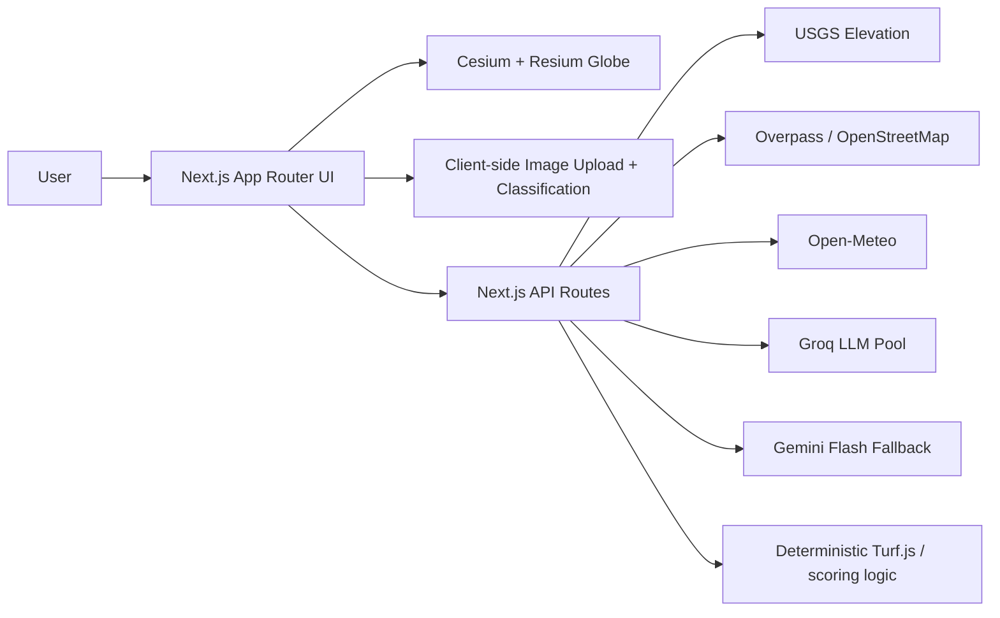

# GeoSight

GeoSight is an intelligent geospatial analysis platform built for asking open-ended questions about places on top of a 3D globe. The featured MVP story centers on Pacific Northwest data center cooling, but the platform is intentionally broader: click anywhere, search for cities or landmarks, inspect terrain and infrastructure context, upload imagery, and ask location-based questions across many use cases.

## Vision

- Explore terrain, water access, infrastructure, and climate from a living 3D globe.
- Blend deterministic geospatial scoring with natural-language analysis.
- Support multiple evaluation modes on the same geography: cooling infrastructure, outdoor recreation, residential development, retail, logistics, and general exploration.
- Keep the stack deployable on free tiers: Cesium Ion, Groq, Gemini, Open-Meteo, USGS, and OpenStreetMap.

## What's in the MVP

- Cesium globe with Pacific Northwest default fly-to
- Search and click-to-analyze workflow for coordinates and named places
- Region selection rectangle and overlay toggles
- Groq + Gemini geospatial Q&A endpoint with profile-aware routing and deterministic fallback
- Deterministic site viability scoring and comparison table
- Satellite image upload with client-side MVP land cover estimation
- Terrain exaggeration control and elevation profile panel
- Preloaded demo sites for The Dalles, Boardman, and Wenatchee

## Screenshots / GIFs

Add screenshots after first local run:

- `docs/geosight-globe.png`
- `docs/geosight-analysis-panel.png`
- `docs/geosight-comparison-table.png`

## Setup

1. Install dependencies:

```bash
npm install
```

2. Create your local environment file:

```bash
cp .env.example .env.local
```

3. Add free API credentials:

- `NEXT_PUBLIC_CESIUM_ION_TOKEN`: create a free account at [Cesium Ion](https://cesium.com/ion/)
- `GROQ_API_KEY`: primary Groq key from [Groq Console](https://console.groq.com/)
- `GROQ_API_KEY_2`: optional second Groq key to expand the free-tier request pool
- `GROQ_API_KEY_3`: optional third Groq key to expand the free-tier request pool
- `GEMINI_API_KEY`: fallback key from [Google AI Studio](https://aistudio.google.com/)

4. Start the development server:

```bash
npm run dev
```

5. Open [http://localhost:3000](http://localhost:3000)

## Deployment on Vercel

1. Push the repository to GitHub.
2. Import the project into [Vercel](https://vercel.com/new).
3. Add:
   - `NEXT_PUBLIC_CESIUM_ION_TOKEN`
   - `GROQ_API_KEY`
   - `GROQ_API_KEY_2`
   - `GROQ_API_KEY_3`
   - `GEMINI_API_KEY`
4. Deploy.

The app is already structured for Vercel serverless routes under `src/app/api/*`.

## Architecture



## Future roadmap

- Real polygon drawing tools and spatial editing on the globe
- LiDAR and National Map layer integration
- Mineral detection and subsurface suitability overlays
- Multi-region benchmarking beyond the Pacific Northwest
- Better land cover inference with TensorFlow.js model assets in `public/models`
- Exportable reports for site comparison and due diligence packets

## Planning docs

- Backlog and roadmap: [`docs/BACKLOG.md`](docs/BACKLOG.md)
- Platform and product standards: [`agents.md`](agents.md)
