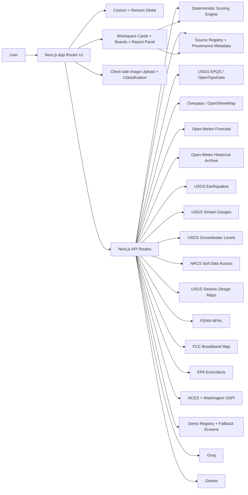

# GeoSight

GeoSight is a live geospatial reasoning platform for asking grounded questions about any place on Earth. It combines a 3D globe, mission-aware AI, deterministic scoring, reusable workspace cards, and explicit provenance so users can investigate infrastructure, hazards, schools, terrain, climate, and nearby places without losing trust.

## Vision

- Explore terrain, water access, infrastructure, hazards, and climate from a living 3D globe.
- Blend deterministic geospatial scoring with natural-language analysis and structured report generation.
- Support multiple evaluation modes on the same geography: infrastructure, outdoor recreation, residential development, commercial logistics, and open-ended exploration.
- Keep the stack deployable on free tiers wherever possible: Cesium Ion, Groq, Gemini, Open-Meteo, USGS, NRCS, EPA, FEMA, FCC, and OpenStreetMap.

## What GeoSight Shows Today

- Cesium globe with a routed explore workspace and mission-aware landing flow
- Search and click-to-analyze workflow for coordinates and named places
- Mission profiles for data-center cooling, hiking and recreation, residential development, commercial analysis, and a clearly labeled General Exploration entry that currently uses the residential lens
- GeoAnalyst chat backed by Groq with Gemini and deterministic fallback
- GeoScribe report generation that turns the live location bundle into a structured site assessment
- Deterministic scoring, factor evidence labels, methodology explanations, and saved-site comparison tables
- Registry-aware source metadata with freshness, confidence, region coverage, and fallback-provider context
- Climate, hazard, hydrology, terrain, school, contamination, broadband, and amenities cards inside a registry-driven workspace
- Satellite image upload with client-side MVP land-cover estimation
- Terrain exaggeration controls and an elevation profile panel
- Groundwater monitoring well levels and water-table depth from USGS
- USDA soil profile with drainage class, hydrologic group, depth to water table, and depth to bedrock
- Site-specific seismic design parameters from USGS design maps (ASCE 7-22)
- 10-year historical climate trend analysis with warming, cooling, or stable indicators
- Competition-ready demos for Columbia River infrastructure, Tokyo commercial analysis, and Washington residential due diligence
- Demo fallback messaging and screenshot-backed competition paths for slow live loads

## What GeoSight Does Not Claim Yet

- It is not a parcel-entitlement engine, hydraulic model, geotechnical report, appraisal system, or formal engineering tool.
- Several important domains remain US-first today, especially broadband, FEMA flood zones, EPA contamination screening, school intelligence, soil profile, groundwater, and seismic design values.
- Some score factors still use proxy heuristics where no direct live signal exists yet. Those factors are labeled explicitly in the factor breakdown.

## What Judges Should Try First

1. Open the Columbia River infrastructure story from the landing page or go straight to `/explore?profile=data-center&demo=pnw-cooling&entrySource=demo&judge=1&missionRun=competition-columbia`.
2. Run the mission briefing, then open the score, comparison, and source-awareness cards to show that the recommendation is both memorable and defensible.
3. Generate a GeoScribe report from that same location to show that the AI can produce a structured deliverable instead of only chat replies.
4. Switch to Tokyo to prove the same workflow works outside the Pacific Northwest and to show how GeoSight names global coverage limits honestly.
5. Search `Bellevue, WA` to show school context, trust signals, and the new subsurface cards together.

## Competition Package

The competition handoff package lives in [`docs/competition/`](docs/competition/README.md).

- Demo scripts for 90 seconds, 3 minutes, and 5 minutes
- Pitch deck outline
- One-page methodology and source sheet
- Recorded-demo fallback guide
- Screenshot, GIF, and backup-video capture checklist

## Screenshots / GIFs

Capture targets are defined in the competition docs package. The current package assumes these asset names:

- `docs/captures/01-landing-hero.png`
- `docs/captures/02-columbia-river-mission-run.png`
- `docs/captures/03-columbia-river-comparison.png`
- `docs/captures/04-tokyo-commercial-mission-run.png`
- `docs/captures/05-washington-school-context.png`
- `docs/captures/06-source-provenance.png`
- `docs/captures/geo-sight-primary-demo.gif`
- `docs/captures/geo-sight-globality.gif`
- `docs/captures/geo-sight-backup-demo.mp4`

## Setup

1. Install dependencies:

```bash
npm install
```

2. Create your local environment file:

```bash
cp .env.example .env.local
```

3. Add credentials:

- `NEXT_PUBLIC_CESIUM_ION_TOKEN`: free account at [Cesium Ion](https://cesium.com/ion/)
- `GROQ_API_KEY`: primary Groq key from [Groq Console](https://console.groq.com/)
- `GROQ_API_KEY_2`: optional second Groq key to expand the free-tier request pool
- `GROQ_API_KEY_3`: optional third Groq key to expand the free-tier request pool
- `GEMINI_API_KEY`: fallback key from [Google AI Studio](https://aistudio.google.com/)
- `NASA_FIRMS_MAP_KEY`: optional but recommended to enable live global fire detections
- `UPSTASH_REDIS_REST_URL` and `UPSTASH_REDIS_REST_TOKEN`: optional but recommended shared rate-limit store from [Upstash Redis](https://upstash.com/)

4. Start the development server:

```bash
npm run dev
```

5. Open [http://localhost:3000](http://localhost:3000)

## Deployment on Vercel

1. Push the repository to GitHub.
2. Import the project into [Vercel](https://vercel.com/new).
3. Add:
   - `NEXT_PUBLIC_CESIUM_ION_TOKEN`
   - `GROQ_API_KEY`
   - `GROQ_API_KEY_2`
   - `GROQ_API_KEY_3`
   - `GEMINI_API_KEY`
   - `NASA_FIRMS_MAP_KEY`
   - `UPSTASH_REDIS_REST_URL`
   - `UPSTASH_REDIS_REST_TOKEN`
4. Deploy.

The app is structured for Vercel App Router routes under `src/app/api/*`, with extended route durations configured for the heavier geodata and agent flows.

## Architecture



## Next Milestones

- Richer live hazard and resilience layers beyond the current earthquake, fire, weather, and FEMA baseline
- Stronger inline provenance so headline insights carry source, freshness, and confidence without opening a separate panel
- Formal contract-backed cards and saved user-authored workspace layouts
- More live non-US provider integrations that turn the source registry from guidance into active regional switching
- Better travel, development, and research workflows built on the same card substrate
- Stronger export and share flows beyond the current GeoScribe panel, including reusable due-diligence artifacts
- LiDAR, National Map, and other advanced observational layers where they add real analytical value

## Planning Docs

- Backlog and roadmap: [`docs/BACKLOG.md`](docs/BACKLOG.md)
- Platform and product standards: [`agents.md`](agents.md)
- Competition submission package: [`docs/competition/README.md`](docs/competition/README.md)
