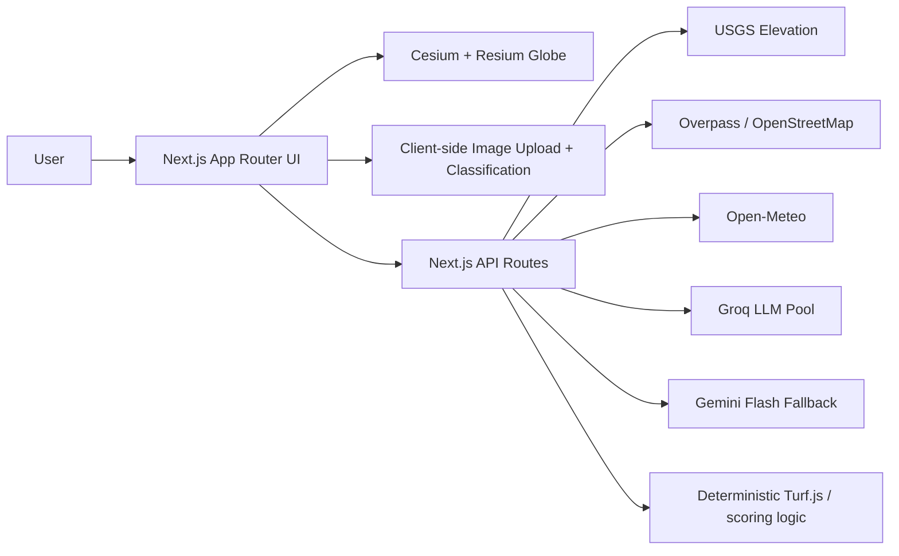

# GeoSight

GeoSight is a live geospatial reasoning platform for asking grounded questions about any place on Earth. It combines a 3D globe, mission-aware AI, deterministic scoring, and source-aware cards so users can investigate infrastructure, hazards, schools, terrain, climate, and nearby places without losing provenance.

## Vision

- Explore terrain, water access, infrastructure, and climate from a living 3D globe.
- Blend deterministic geospatial scoring with natural-language analysis.
- Support multiple evaluation modes on the same geography: cooling infrastructure, outdoor recreation, residential development, retail, logistics, and general exploration.
- Keep the stack deployable on free tiers: Cesium Ion, Groq, Gemini, Open-Meteo, USGS, and OpenStreetMap.

## What GeoSight Shows

- Cesium globe with a routed explore workspace
- Search and click-to-analyze workflow for coordinates and named places
- Mission profiles for infrastructure, hiking, residential, commercial, and general exploration
- Groq + Gemini geospatial Q&A endpoint with profile-aware routing and deterministic fallback
- Deterministic site viability scoring, factor evidence labels, and comparison tables
- Source-aware inline provenance for headline stats and analysis cards
- Satellite image upload with client-side MVP land cover estimation
- Terrain exaggeration control and elevation profile panel
- Competition-ready demo paths for Columbia River infrastructure, Tokyo commercial analysis, and Washington residential due diligence

## What Judges Should Try First

1. Open the Columbia River infrastructure story from the landing page or go straight to `/explore?profile=data-center&demo=pnw-cooling&entrySource=demo&judge=1&missionRun=competition-columbia`.
2. Ask for a shortlist, a comparison, and a recommendation so the mission-run story and evidence stack are visible.
3. Switch to the Tokyo commercial path to prove the app is not Pacific Northwest-only.
4. Try a Washington residential search such as `Bellevue, WA` to see school context and trust signals together.
5. Open the source and factor detail cards only after the main story lands, so the demo stays calm and judge-friendly.

## Competition Package

The competition handoff package lives in [`docs/competition/`](docs/competition/README.md).

- Demo scripts for 90 seconds, 3 minutes, and 5 minutes
- Pitch deck outline
- One-page methodology/source sheet
- Recorded-demo fallback guide
- Screenshot and GIF capture checklist

## Screenshots / GIFs

Capture targets are defined in the competition docs package. These assets are still to be recorded:

- `docs/captures/01-landing-hero.png`
- `docs/captures/02-columbia-river-mission-run.png`
- `docs/captures/03-tokyo-commercial-mission-run.png`
- `docs/captures/04-residential-school-context.png`
- `docs/captures/05-comparison-and-provenance.png`
- `docs/captures/geo-sight-primary-demo.gif`
- `docs/captures/geo-sight-backup-demo.mp4`

## Setup

1. Install dependencies:

```bash
npm install
```

2. Create your local environment file:

```bash
cp .env.example .env.local
```

3. Add free API credentials:

- `NEXT_PUBLIC_CESIUM_ION_TOKEN`: create a free account at [Cesium Ion](https://cesium.com/ion/)
- `GROQ_API_KEY`: primary Groq key from [Groq Console](https://console.groq.com/)
- `GROQ_API_KEY_2`: optional second Groq key to expand the free-tier request pool
- `GROQ_API_KEY_3`: optional third Groq key to expand the free-tier request pool
- `GEMINI_API_KEY`: fallback key from [Google AI Studio](https://aistudio.google.com/)
- `UPSTASH_REDIS_REST_URL` and `UPSTASH_REDIS_REST_TOKEN`: optional but recommended shared rate-limit store from [Upstash Redis](https://upstash.com/)

4. Start the development server:

```bash
npm run dev
```

5. Open [http://localhost:3000](http://localhost:3000)

## Deployment on Vercel

1. Push the repository to GitHub.
2. Import the project into [Vercel](https://vercel.com/new).
3. Add:
   - `NEXT_PUBLIC_CESIUM_ION_TOKEN`
   - `GROQ_API_KEY`
   - `GROQ_API_KEY_2`
   - `GROQ_API_KEY_3`
   - `GEMINI_API_KEY`
   - `UPSTASH_REDIS_REST_URL`
   - `UPSTASH_REDIS_REST_TOKEN`
4. Deploy.

The app is already structured for Vercel serverless routes under `src/app/api/*`.

## Architecture



## Future roadmap

- Real polygon drawing tools and spatial editing on the globe
- LiDAR and National Map layer integration
- Mineral detection and subsurface suitability overlays
- Multi-region benchmarking beyond the Pacific Northwest
- Better land cover inference with TensorFlow.js model assets in `public/models`
- Exportable reports for site comparison and due diligence packets

## Planning docs

- Backlog and roadmap: [`docs/BACKLOG.md`](docs/BACKLOG.md)
- Platform and product standards: [`agents.md`](agents.md)
- Competition submission package: [`docs/competition/README.md`](docs/competition/README.md)
