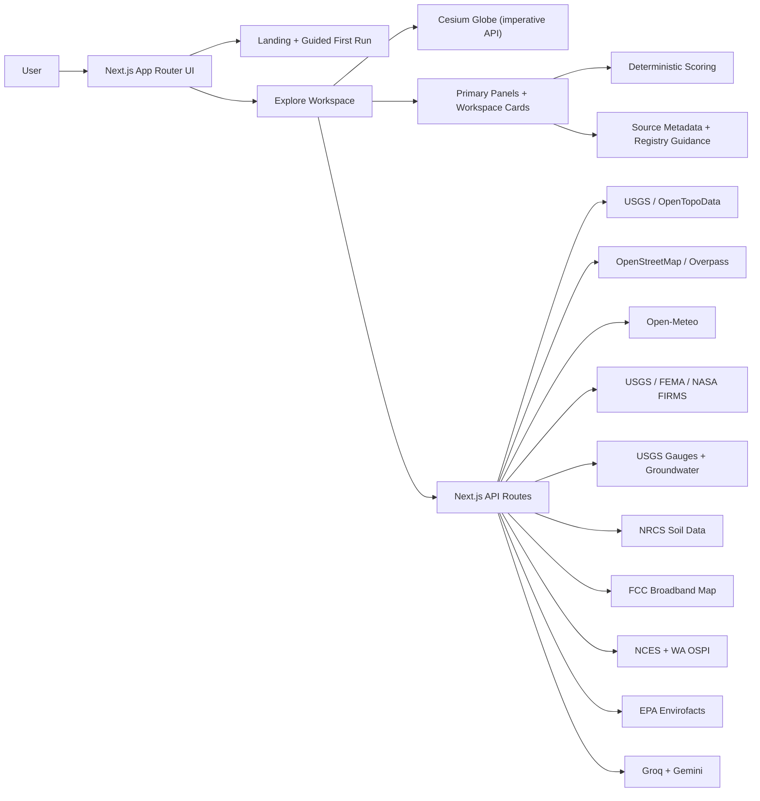

# GeoSight

GeoSight is a geospatial intelligence app for investigating real places with a 3D globe, live public data, lens-specific scoring, and source-aware reasoning.

It is built for first-pass location decisions:

- buyers comparing neighborhoods
- planners and developers screening sites
- infrastructure teams checking access, water, climate, and risk
- researchers or analysts investigating a place quickly
- travelers and outdoor users exploring terrain, nearby places, and conditions

GeoSight is not "map plus chatbot." The product goal is to help a user search a place, understand what stands out, see why the score moved, and inspect the trustworthiness of the underlying evidence without needing GIS software.

## What GeoSight Does

GeoSight combines:

- a Cesium/Resium 3D globe
- mission or lens-based analysis profiles
- deterministic place scoring
- live and derived geospatial signals
- reusable workspace cards
- source freshness and coverage metadata
- AI-assisted narrative and report generation grounded in the active location bundle

The current product supports lenses for:

- Home Buying
- Residential Site Development
- Data Center Cooling
- Commercial / Warehouse
- Hiking / Recreation

Each lens changes what GeoSight emphasizes. The same place can read well for one decision and poorly for another.

## Quick Start

1. Open the landing page and choose a lens or pick Explorer mode for a simpler first-run experience.
2. Search a real place — address, neighborhood, landmark, or coordinates.
3. Read the analysis overview, then open factor breakdown, source awareness, hazards, or other supporting cards as needed.
4. Generate a GeoScribe report from the same location to produce a structured deliverable instead of only chat replies.
5. Save sites and use the comparison table to evaluate multiple candidates side by side.

## What A First-Time User Sees

On first load, GeoSight should answer three questions quickly:

- What is this?
  GeoSight is a place-investigation tool for real-world decisions.
- What can I do here?
  Search a location and analyze it through a specific lens.
- What should I do next?
  Start with one place, read the analysis overview, then inspect score, tradeoffs, and source trust.

## Trust Model

GeoSight follows a strict hierarchy:

- direct live source data
- derived live analysis from those sources
- clearly labeled demo overlays only where explicitly intended
- no fabricated live results in normal flows

The UI distinguishes between:

- live
- derived
- limited
- unavailable
- cached or partial analysis states where applicable

When a source is unsupported or missing, GeoSight should show the gap instead of guessing.

## What The Product Shows Today

- Routed landing page and `/explore` workspace
- Search, geocode, and click-to-analyze flows
- Guided first-run flow with clearer analysis framing
- Cesium globe with layer toggles, region controls, and terrain tools
- Lens-aware scoring and factor breakdowns
- Location overview with tradeoffs, trust notes, and source-aware summaries
- Nearby places discovery using live OpenStreetMap mapping
- Source awareness panel with provider freshness, coverage, and regional strategy
- GeoAnalyst reasoning flow and GeoScribe report generation
- Saved-site comparison table
- Registry-driven workspace cards and board mode
- Housing, hazard, climate, school, broadband, flood, contamination, groundwater, soil, seismic, and air-quality cards
- Image upload and client-side land-cover estimation

## Major Data Sources And Signals

Core source families currently include:

- Terrain and elevation
  - USGS EPQS
  - OpenTopoData fallback
- Globe and visualization
  - Cesium Ion
  - Cesium World Terrain
- Nearby places and mapped context
  - OpenStreetMap
  - Overpass
- Weather and climate
  - Open-Meteo forecast
  - Open-Meteo historical archive
- Hazards
  - USGS earthquakes
  - NASA FIRMS active fire detections
  - FEMA NFHL flood zones
- Hydrology and water
  - mapped water proximity
  - USGS stream gauges
  - USGS groundwater wells
- Environmental context
  - OpenAQ / Open-Meteo air quality
  - EPA Envirofacts contamination screening
- Connectivity and amenities
  - FCC Broadband Map
  - OpenStreetMap amenity density
- Schools
  - NCES baseline school data
  - Washington OSPI accountability where available
- Subsurface and engineering context
  - USDA NRCS soil profile
  - USGS seismic design maps

Signals shown in the product include examples such as:

- elevation and terrain practicality
- nearest road, water, and power context
- current weather and 10-year climate trends
- earthquake, fire, and flood context
- broadband availability
- school access
- contamination screening
- groundwater depth
- soil drainage and depth to bedrock
- seismic design parameters
- mapped nearby places and amenities

## What GeoSight Does Not Claim

- It is not an engineering sign-off tool.
- It is not a parcel-entitlement system.
- It is not an appraisal model.
- It is not a replacement for official due diligence.
- Some domains remain US-first today, especially broadband, flood, contamination, schools, soil, groundwater, and seismic design.
- Some score factors still rely on proxy heuristics where direct live signals do not yet exist. Those factors are labeled in the UI.

## Technical Stack

- Next.js App Router
- React 19
- TypeScript
- Tailwind CSS v4
- Cesium + Resium
- Recharts
- Groq and Gemini for AI-assisted reasoning and report generation
- Vercel-ready API routes under `src/app/api/*`

## Repository Structure

Important entry points and product surfaces:

- App entry
  - `src/app/page.tsx`
  - `src/components/Landing/LandingPage.tsx`
- Explore workspace
  - `src/app/explore/page.tsx`
  - `src/components/Explore/ExploreWorkspace.tsx`
  - `src/components/Explore/ExploreWorkspacePanels.tsx`
- State and analysis pipeline
  - `src/hooks/useExploreState.ts`
  - `src/hooks/useExploreData.ts`
  - `src/hooks/useSiteAnalysis.ts`
- Scoring
  - `src/lib/scoring.ts`
  - `src/lib/scoring-methodology.ts`
- Card registry
  - `src/lib/workspace-cards.ts`
- Source registry and trust metadata
  - `src/lib/source-registry.ts`
  - `src/lib/source-metadata.ts`
- Main geodata route
  - `src/app/api/geodata/route.ts`

## Running Locally

1. Install dependencies:

```bash
npm install
```

2. Create a local environment file:

```bash
cp .env.example .env.local
```

3. Add the environment variables you want to enable:

- `NEXT_PUBLIC_CESIUM_ION_TOKEN`
- `GROQ_API_KEY`
- `GEMINI_API_KEY`
- `NASA_FIRMS_MAP_KEY`
- `UPSTASH_REDIS_REST_URL`
- `UPSTASH_REDIS_REST_TOKEN`

Notes:

- `NEXT_PUBLIC_CESIUM_ION_TOKEN` is the main required token for the globe.
- `GROQ_API_KEY` is the only Groq key the app uses for live Groq requests.
- `GEMINI_API_KEY` stays configured as the secondary live provider if Groq truly fails.
- `GROQ_API_KEY` and `GEMINI_API_KEY` enable AI reasoning and report generation.
- `NASA_FIRMS_MAP_KEY` improves fire coverage.
- Upstash Redis variables are optional but recommended for shared rate limiting.

4. Start the dev server:

```bash
npm run dev
```

5. Open:

```text
http://localhost:3000
```

Useful checks:

```bash
npm run typecheck
npm run lint
```

## Deployment

GeoSight is structured for Vercel deployment.

1. Push the repository to GitHub.
2. Import the repo into Vercel.
3. Add the same environment variables used locally.
4. Deploy.

## Architecture Overview



## Demo Notes

Good first-run examples:

- `Bellevue, WA` for Home Buying
- `The Dalles, OR` for Data Center Cooling
- `Phoenix, AZ` for Commercial / Warehouse
- `Olympic National Park` for Hiking / Recreation

The public app is deployed at:

- [geosight-gspat.vercel.app](https://geosight-gspat.vercel.app/)

## Planning Docs

- Backlog and roadmap: [`docs/BACKLOG.md`](docs/BACKLOG.md)
- Platform and product standards: [`agents.md`](agents.md)
